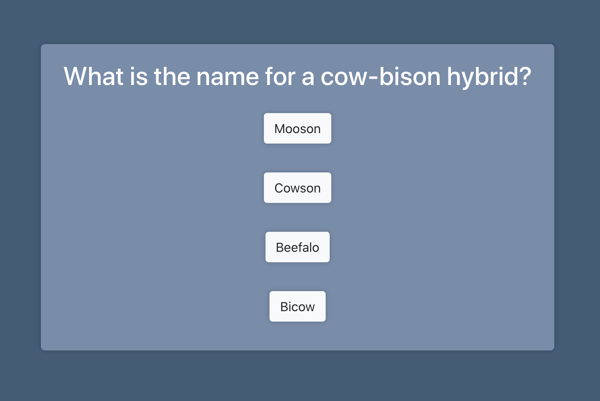

# Triviar 

Triviar is my submission for Tandem's 2020 Apprentice 
Software Engineer coding challenge. 

Triviar is a trivia based app that users can use to 
practice their trivia skills. 

Front end unit tests are written with Enzyme. 




## Table of Contents

- [Installation](https://github.com/kathyn262/triviar#installation)
- [Testing](https://github.com/kathyn262/triviar#testing)
- [Technologies](https://github.com/kathyn262/triviar#technologies)
- [Component Hierarchy](https://github.com/kathyn262/triviar#component-hierarchy)
- [Future Implementations](https://github.com/kathyn262/triviar#future-implementations)

## Installation

Use npm to install dependencies and start the frontend server. 

To install dependencies: 
`npm i`

To start the frontend server: `npm start`

## Testing 
Front end unit tests are written with Enzyme. Run all tests with the following command: 

`npm test --watchAll`

## Technologies 
- React
- Create-React-App
- HTML/CSS
- Bootstrap
- Enzyme

## Component Hierarchy 

```
App
├─┬ StartScreen
│ └─┬ Quiz
│   └─┬ Question
│     └── ResultModal
│
└── EndScreen
```

## Future Implementations

- Play incorrect/correct sounds after a user submits an answer
- Add backend to allow users to compete with friends
- Write more unit tests 
- Write integration tests
